# Veri Yapıları

### Bilgisayar Mimarisi

Bilgisayar Mimarisi, bilgisayar parçalarının
iç yapıları ve aralarındaki haberleşme
bağlantıları ile ilgilidir.

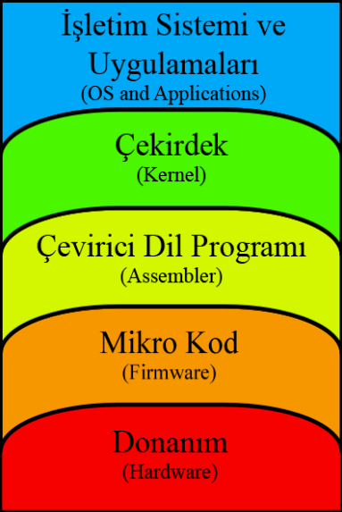

| Mimari                                                                                                                                                                                         |
|------------------------------------------------------------------------------------------------------------------------------------------------------------------------------------------------|
| **Bilgisayar donanımı**, bir bilgisayarı oluşturan fiziksel parçaların genel adıdır.                                                                                                           |
| **Mikro kod**, mikroişlemcinin komut seti ile yazılmış olan yazılımlardır.                                                                                                                     |
| **Çevirme Dili** (Assembly Language) bilgisayar programlarını yazmak için kullanılan düşük seviyeli bir programlama dilidir.                                                                   |
| **Çekirdek**, işletim sisteminin kalbidir. Uygulamalar ve donanım seviyesindeki bilgi işlemleri arasında bir köprü görevi görür.                                                               |
| **İşletim sistemi** (Operating System), bilgisayarda çalışan, bilgisayar donanım kaynaklarını yöneten ve çeşitli uygulama yazılımları için yaygın servisleri sağlayan bir yazılımlar bütünüdür |

#### Önbellek

- Günümüz bilgisayarlarında, ön bellek kullanılarak bellekle
  tek yoldan iletişim ve buyrukla verinin aynı bellekte
  bulunma sorunu çözülmüştür.
- Ana bellek ile merkezi işlem birimi arasında görev yapan
  ve ana bellekten çok daha hızlı olan bir bellektir.
- Önbellek, işlem esnasında çok sık kullanılan
  bilgisayar talimatları ve geçici olarak tutulan bilgiler için bir
  “yaz-boz tahtası” olarak kullanılır.
- CPU ’nun ana bellekten veri alırken harcadığı zamanı
  azaltır; bu da bilgisayarı hızlandırır.

#### Mikroişlemci

- Bilgisayarın kalbidir. İşlemcinin görevi,
  buyrukların bellekten getirilmesi, çözülmesi ve
  çalıştırılması, sonuçların gözlenmesi, program
  işlenirken diğer donanım birimlerinden gelen
  kesme (interrupt) isteklerine cevap vermesi gibi
  işlemlerdir
- Günümüzde bu yapıya uygun iki bellek tipi
  vardır: ROM (Read Only Memory) ve RAM
  (Random Access Memory).
- ROM üzerindeki bilgiler
  kalıcıdır. Mikrokodların
  bulunduğu bellektir. Firma
  tarafından yüklenir.
- RAM üzerindeki bilgiler ise
  istenildiği zaman okunabilir ve
  yazılabilir. Elektrik
  kesintilerinde RAM üzerindeki
  tüm bilgiler silinir.
- RAM bellekler de SRAM
  (Statik RAM) ve DRAM
  (Dynamic RAM) olmak üzere
  2 çeşittir. SRAM çok pahalı ve
  hızlıdır, önbellek olarak
  kullanılırlar.

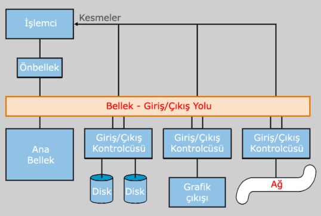

#### BIOS

- ROM Bellek (Read Only Memory, tr: Salt Okunur
  Bellek) içinde yer alan bir tür yazılımdır.
- Bilgisayar kapatılsada ROM içinde tutulur.
- Bilgisayar açıldığı anda işlemciye tüm diğer
  donanımları sırasıyla tanıtır.
- Donanımların temel iletişim protokollerini belirler.
- İşletim sisteminin başlangıç öğelerinin Herhangi bir
  sürücüden (HDD, CD-ROM vb.) yüklenmesini sağlar.
- İşletim sistemi çalışırken donanım ve işletim
  sistemi arasındaki ilişkileri düzenler.

#### Assebly dili

- Assembly dili, programlar yazmak için kullanılan
  düşük seviyeli bir programlama dilidir.
- Bir assembly dil programı, çevirici “Assembler” olarak
  adlandırılan faydalı bir program tarafından hedef
  bilgisayarın makine koduna çevrilir.
- Assembly insanlar tarafından anlaşılması zor olan
  makina dilinin sayısal ifadelerini, insanlar tarafından
  anlaşılarak programlanması daha kolay olan alfabetik
  ifadelerle değiştirerek düşük seviyede programlama
  için bir ortam oluşturur.
- Assembly kullanmanın amacı, ilk bilgisayarlarda
  yazılan programların daha az hata içermesi ve daha az
  zaman almasını sağlamaktır.

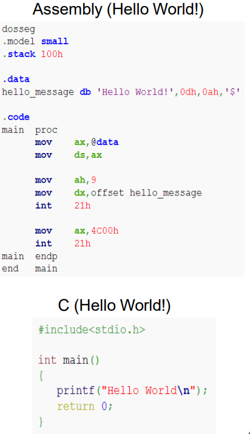

#### Çekirdek (Kernel)

- İşletim sistemi çekirdeği, kısaca çekirdek
  (kernel), işletim sisteminin kalbidir
- Uygulamalar ve donanım
  seviyesindeki bilgi işlemleri arasında bir
  köprü görevi görür.
- Çekirdeğin görevleri sistemin
  kaynaklarını yönetmeyi de
  kapsamaktadır.
- İşletim sistemi görevleri,
  tasarımları ve uygulanmalarına
  göre farklı çekirdekler tarafından farklı
  şekillerde yapılır.
- Sistem açılırken belleğe yüklenir
  ve sistem kapatılıncaya kadar bellekte
  kalır.
- Linux çekirdeği açık kaynak kodlu olduğu
  için üzerine yeni işletim sistemleri
  geliştirilebilir. (Pardus)

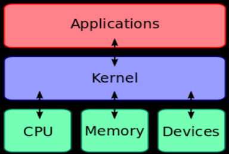

#### İşletim Sistemleri

- İşletim sistemi, bilgisayarda çalışan, bilgisayar donanım
  kaynaklarını yöneten ve çeşitli uygulama yazılımları için
  yaygın servisleri sağlayan bir yazılımlar bütünüdür.
- İşletim sistemleri sadece bilgisayar, video oyun konsolları,
  cep telefonları ve web sunucularında değil; arabalarda,
  beyaz eşyalarda hatta kol saatlerinin içinde bile yüklü
  olabilir.
- İşletim sistemleri işlevsellerinin genişliği ile değil,
  donanımı belli bir amaç doğrultusunda
  programlayabilme nitelikleriyle değerlendirilmelidir.

#### Veri

- Veri, algoritmalar tarafından işlenen en temel
  elemanlardır(sayısal bilgiler, resim, metinsel bilgiler, sesler
  ve girdi çıktı bilgileri vb. ) Bir algoritmanın etkin, anlaşılır
  ve doğru olabilmesi için, algoritmanın işleyeceği verilerin
  düzenlenmesi gerekir.

#### Veri Yapıları

###### Veri Yapısı

- Verinin veya bilginin bellekte tutulma şeklini veya düzenini gösterir.
- Tüm programlama dillerinin genel olarak, tam sayı, kesirli sayı, karakter ve sözcük
  saklanması için temel veri yapıları vardır
- Programcı bu veri yapılarını, bunların bellekte nasıl saklandığı konusuyla
  ilgilenmeksizin bolca kullanır
- Tasarlanacak program, temel veri yapısı dışında farklı veri yapısına ihtiyaç
  duyuyorsa, bunlar kullanılan programlama dilinin elverdiği ölçüde
  tanımlanmalıdır. Örneğin; struct (topluluk) ve union (ortaklık).

###### Veri Modeli

- Verilerin birbirleriyle ilişkisel veya sırasal durumunu gösterir;
  problemin çözümü için kavramsal bir yaklaşım yöntemidir denilebilir.
- Bilgisayar ortamında uygulanacak tüm matematik ve mühendislik problemleri
  bir veri modeline yaklaştırılarak veya yeni veri modelleri tanımlaması yapılarak
  çözülebilmektedir.
- Her program en azından bir veri modeline dayanır.
- Uygun veri modelinin seçilmesi ve kullanılması; uygulama için en etkin
  programın yazılmasını sağlar (Etkinlik: hız veya bellek gereksinimi olabilir).

#### Algoritma

- Bir problemin çözümünde kullanılan komutlar dizisi. Bir
  problemi çözmek için geliştirilmiş kesin bir yöntemdir.
  Bir algoritma, bir programlama dilinde (Java, C, Python
  gibi) ifade edildiğinde **program** adını alır.

### Veri Yapılarına Neden İhtiyaç Vardır?

- Bilgisayar yazılımları gün geçtikçe daha karmaşık bir hal
  almaktadır.
- Yazılımların programlanması ve yönetimi zorlaşmaktadır.
- Örneğin 8 milyar sayfanın indekslenmesi (Google)
- Veri yapıları, daha etkin ve daha doğru program yazmayı sağlar.

İyi bir yazılım için gereksinimler:

- Temiz birtasarım
- Kolay bakım ve yönetim
- Güvenilir
- Kolay kullanımlı
- Hızlı algoritmalar

`Örnek:`
Her biri satır başına ortalama 10 kelimeden ve yine ortalama 20 satırdan oluşan 3000 metin koleksiyonu olduğunu
düşünelim. 
→600,000 kelime 
Bu metinler içinde “dünya” kelimesi ile eşleşecek bütün kelimeleri bulmak isteyelim 
Doğru eşleştirme için yapılacak karşılaştırmanın 1 sn. sürdüğünü varsayalım. 
`**Ne yapılmalıdır?**`

**Örnek**  

1. [ ] Çözüm.1: 
   `Sıralı eşleştirme:` 1 sn. x 600,000 kelime= **166 saat** 
2. [ ] Çözüm.2: 
   `İkili Arama (Binary searching):` 
   kelimeler sıralanır 
   sadece tek yarıda arama yapılır 
   toplam adım sayısı log 2 N= log 2 600000 yaklaşık 20 adım 
   (çevrim) **20 sn**. 
   **20 saniye veya 166 saat!**

### Veri Yapılarının Sınıflandırılması

- Veri Yapıları -> **Temel Veri Yapıları** ve **Tanınlamalı (Bileşik) Veri Yapıları**

| Temel Veri Yapıları                                                                                                           | Tanınlamalı (Bileşik) Veri Yapıları                                                                                                                                                       |
|-------------------------------------------------------------------------------------------------------------------------------|-------------------------------------------------------------------------------------------------------------------------------------------------------------------------------------------|
| **Temel veri yapıları**, daha çok programlama dilleri tarafından doğrudan değişken veya sabit bildirimi yapılarak kullanılır. | **Tanımlamalı veri yapıları**, kendisinden önceki tanımlamalı veya temel veri yapıları üzerine kurulurlar; yani, önceden geçerli olan veri yapıları kullanılarak sonradan tanımlanırlar.  |

#### Temel Veri Yapıları

- Tüm programlama dillerinin, genel olarak, karakter, tamsayı, kesirli
  sayı ve sözcük (karakter katarı) saklanması için temel veri yapıları
  vardır. Veri yapısı, aslında, ham olarak 1 ve 0’lardan oluşan verinin
  yorumlanmasını belirleyen biçimleme (formating) düzenidir.
  Örneğin, 62 sayısının ikili tabandaki karşılığı, 111110 olarak
  bellekte saklanır.
- Temel veri yapıları aşağıdaki gibi sınıflanabilir:
  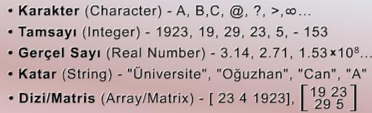

#### Tanımlamalı (Bileşik) Veri Yapıları

- Tanımlamalı veri yapısı, temel veya daha önceden tanımlanmış veri yapılarının
  kullanılıp yeni veri yapıları oluşturulmasıdır.
- Üç değişik şekilde yapılabilir:

| Tanımlamalı (Bileşik) Veri Yapıları | Açıklama                                                                                                                                                                                                      |
|-------------------------------------|---------------------------------------------------------------------------------------------------------------------------------------------------------------------------------------------------------------|
| Topluluk (Struct) Oluşturma         | Birden çok veri yapısının bir araya getirilip yeni bir veri yapısı ortaya çıkarmaktır. (Java dilinde sınıflar)                                                                                                |
| Ortaklık (Union) Oluşturma          | Birden çok değişkenin aynı bellek alanını kullanmasını sağlayan veri yapısı tanımlamasıdır. Ortaklıkta en fazla yer işgal eden veri yapısı hangisi ise, ortaklık içerisindeki tüm değişkenler orayı paylaşır. |
| Bit Düzeyinde Erişim                | Verinin her bir bit’i üzerinde diğerlerinden bağımsız olarak işlem yapılması olanağı sunar                                                                                                                    |

Not :  Her birinin kullanım amacı farklı farklı olup uygulamaya göre bir tanesi veya
hepsi bir arada kullanılabilir. Genel olarak, en çok kullanılanı topluluk
oluşturmadır; böylece birden fazla veri yapısı bir araya getirilip/paketlenip yeni
bir veri yapısı/türü ortaya çıkarılır

- C dilinde tanımlamalı veri yapılarına örnek aşağıda
  verilmiştir:

  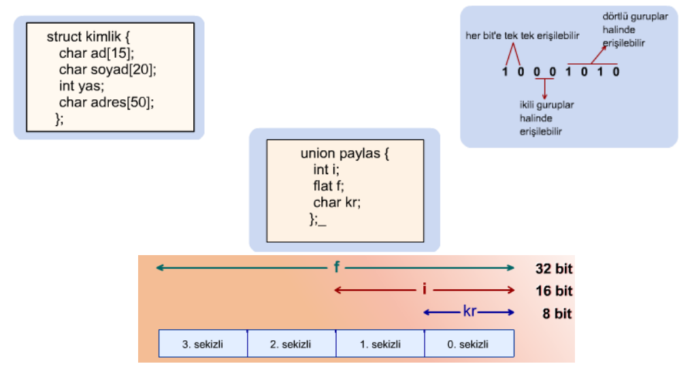

### Veri Modelleri

- Veri modelleri, tasarımı yapılacak programın en uygun ve etkin şekilde
  olmasını sağlar ve daha baştan programın çalışma hızı ve bellek
  gereksinimi hakkında bilgi verir. Çoğu zaman, programın çalışma hızıyla
  bellek gereksinimi miktarı doğru orantılıdır denilebilir.
  Veri modelleri, genel olarak, aşağıdaki gibi verilebilir:

| Veri Modelleri               |
|------------------------------|
| Bağlantılı Liste (Link List) |
|Ağaç (Tree)|
|Graf (Graph)|
|Durum Makinesi (State Machine)|
|Veritabanı-İlişkisel (Database Relational)|
|Ağ Bağlantı (Network Connection)|

#### Liste ve Bağlantılı Liste Veri Modeli
- Liste veri modeli, aynı kümeye ait olan verilerin bellekte
  art arda tutulması ilkesine dayanır. Veriler belirli bir düzen
  içerisinde (sıralı vs.) olabilir veya olmayabilir; önemli olan tüm
  verilerin art arda gelen sırada tutulmasıdır.

  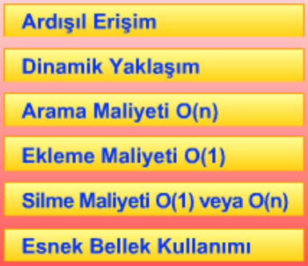
-  **En yalın liste veri modeli** bir boyutlu dizi
   üzerinde tutulanıdır. Böylesi bir listeye eleman
   ekleme işlemi oldukça kolaydır; genel olarak,
   yeni gelen elemanlar listenin sonuna eklenir.
   Yalın listede bir sonraki eleman hemen o elemanın işgal ettiği bellek alanından sonradır

    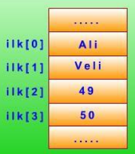
  - **Bağlantılı liste (link list)** ise, elemanların kendi
    değerlerine ek olarak bir de bağlantı bilgisinin
    kullanılmasıyla sağlanır; bağlantı bilgisi bir
    sonraki elemanın adresi niteliğindedir.

    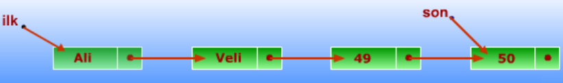

#### Ağaç Veri Modeli
- Ağaç veri modeli, **düğümlerden** ve **dallardan** oluşur.
- Düğümlerde verilerin kendileri veya bir kısmı tutulurken, dallar
diğer düğümlere olan bağlantı ilişkilerini gösterir. 
- Ağaç veri modeli, özellikle kümenin büyük olduğu ve arama işleminin çok
kullanıldığı uygulamalarda etkin bir çözüm sunar.
- En üstteki düğüm kök (root), kendisine alttan hiçbir bağlantının
olmadığı düğüm yaprak (leaf), diğerleri de ara düğüm (internal
node) olarak adlandırılır. Bir düğüme alttan bağlı düğümlere
çocuk (child), üsten bağlı düğüme de o düğümün ailesi
(parent) denilir.

  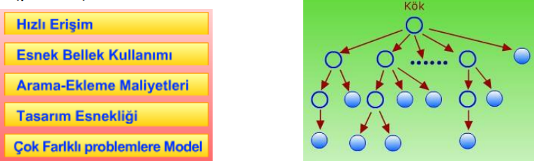

  | Türkçe | İngilizce     | Açıklama                                                              |
  |---------------|-----------------------------------------------------------------------|-----------------------------------------------------------------------|
  | Kök | Root          | En üstteki düğüm                                                      |
  | Yaprak | Leaf          | Kendisine alttan hiçbir bağlantının olmadığı düğüm (En alttaki düğüm) |
  | Ara düğüm | Internal Node | Aradaki, arada kalan düğümler                                         |
  | Çocuk | Child         | Bir düğüme alttan bağlı düğümlere denir                               |
  | Aile | Parent        | Bir düğüme üstten bağlı düğüme o düğümün ailesi denir                 |

- Veriniz üzerinde hızlı arama yapmak istiyorsunuz. Aşağıdaki gibi bir ağaç modeli
  kullanabilirsiniz.
  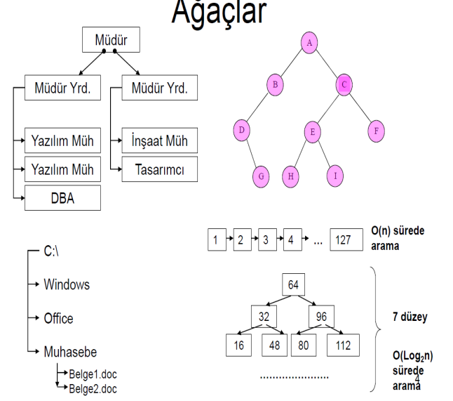

#### Graf Veri Modeli

---
Kaynak : `rkorkmaz@nku.edu.tr` Veri Yapıları Dersi - Bilgisayar Mühendisliği